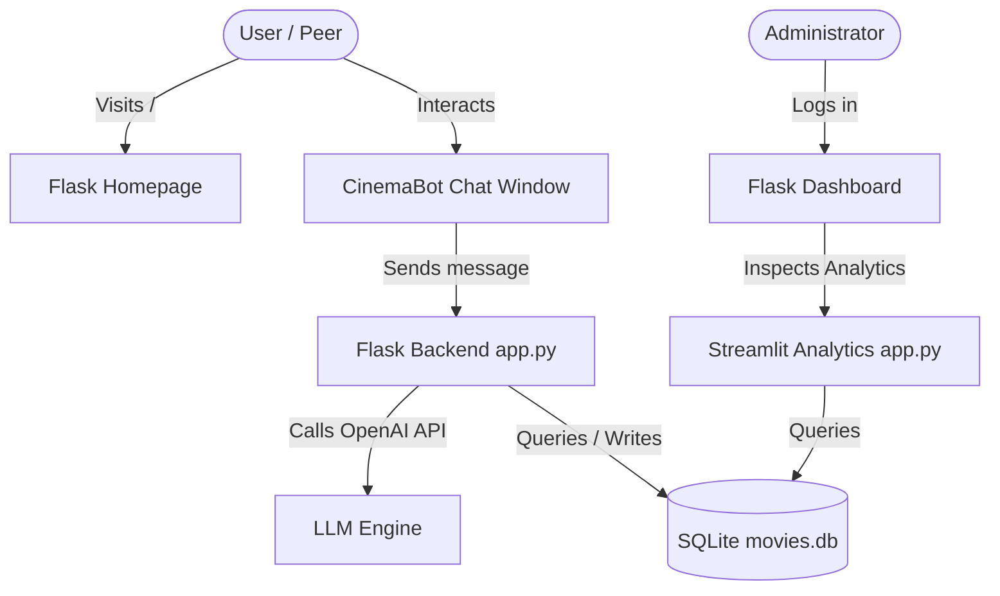

# Codebase Architecture Overview

This document contains the codebase architecture diagram and description for the Stoplight Cinema project. You can copy the Mermaid diagram code directly into tools like [Mermaid Live Editor](https://mermaid.live/) or tools like Github, Notion, or Canva to render it visually.

## Architecture Diagram (Mermaid Format)

## Component Descriptions

1. **Frontend:** 
   - Uses Jinja2 HTML5 templates (`templates/index.html`, `templates/dashboard.html`) styled with HSL variables and Outfit/Poppins typography.
   - Communicates asynchronously via fetch/AJAX requests for chatbot messaging and classmate reviews.
2. **Backend (app.py):**
   - Built with Flask. Manages routes, same-origin iframe simulation, chatbot system prompting, and API login validations.
3. **Database (movies.db):**
   - Relational SQLite database. Houses:
     - `movies` (saved watchlists)
     - `movie_catalog` (cinema schedules and details)
     - `classmate_feedback` (peer evaluations)
     - `movie_comments` (customer reviews and ratings)
4. **Analytics (analytics.py):**
   - Concurrently running Streamlit visualization server that displays charts and database metrics.
